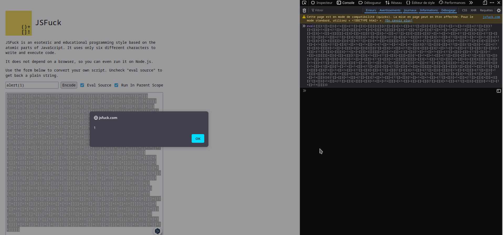

# What's JSfuck ? 
JSFuck is an esoteric and educational programming style based on the atomic parts of JavaScript. It uses only six different characters to write and execute code.
> https://jsfuck.com/

You can use it if some characters are filtered. It can be used with eval, script ... Everything that can load js.

